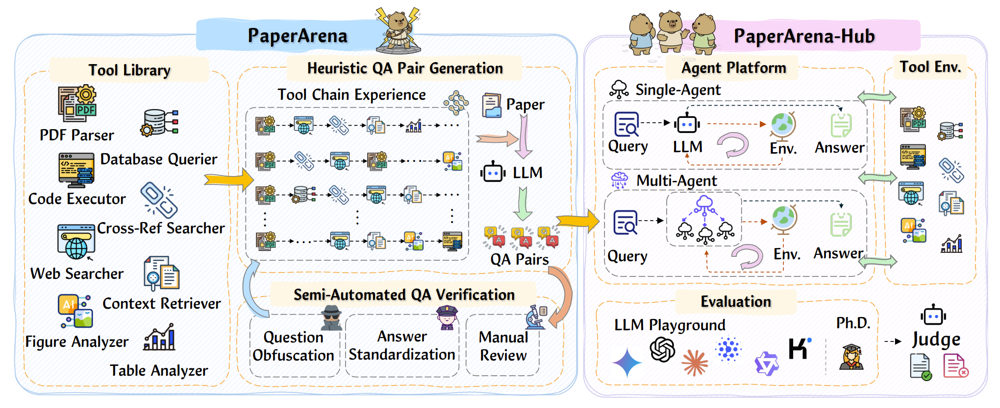

<div align="center">
  <h1>
        🤺 PaperArena: An Evaluation Benchmark for <br> Tool-Augmented Agentic Reasoning <br> on Scientific Literature <br>
  </h1>
</div>

<div align="center">
  <a href="https://arxiv.org/abs/2510.10909">
    📖 <strong>Paper</strong>
  </a> |
  <a href="example.com">
    📊 <strong>Datasets Coming Soon</strong>
  </a>
  <br><br>
  
  
  
  
</div>

---

## 📖 Abstract

Existing benchmarks inadequately test LLM agents on realistic scientific tasks. We introduce **PaperArena**, a new **evaluation benchmark** where agents must address complex research questions by reasoning across multiple papers and using tools. Our platform provides agents with tools for **parsing, retrieval, and computation** to synthesize well-grounded answers. Experiments reveal that even advanced agents achieve **only 38.78%** average accuracy and exhibit inefficient tool usage. PaperArena offers a crucial platform for developing more capable agents for **scientific discovery**.

This repository contains the official code for our [paper](https://arxiv.org/abs/2510.10909):
> PaperArena: PaperArena: An Evaluation Benchmark for Tool-Augmented Agentic Reasoning on Scientific Literature
> Daoyu Wang, Mingyue Cheng$^*$, Qi Liu, Shuo Yu, Zirui Liu, Ze Guo

<details>
<summary><b>Full Abstract</b></summary>

Understanding and reasoning on the web-scale scientific literature is a crucial touchstone for large language model (LLM) based agents designed to support complex knowledge-intensive tasks. However, existing works are mainly restricted to tool-free tasks within isolated papers, largely due to the lack of a benchmark for cross-paper reasoning and multi-tool orchestration in real research scenarios. In this work, we propose PaperArena, an evaluation benchmark for agents to address real-world research questions that typically require integrating information across multiple papers with the assistance of external tools. Given a research question, agents should integrate diverse formats across multiple papers through reasoning and interacting with appropriate tools, thereby producing a well-grounded answer. To support standardized evaluation, we provide a modular and extensible platform for agent execution, offering tools such as multimodal parsing, context retrieval, and programmatic computation. Experimental results reveal that even the most advanced LLM powering a well-established agent system achieves merely 38.78% average accuracy. On the hard subset, accuracy drops to only 18.47%, highlighting great potential for improvement. We also present several empirical findings, including that all agents tested exhibit inefficient tool usage, often invoking more tools than necessary to solve a task. We invite the community to adopt PaperArena to develop and evaluate more capable agents for scientific discovery. Our code and data are available [https://github.com/Melmaphother/PaperArena](https://github.com/Melmaphother/PaperArena).

</details>

## 🎁 Updates/News:

🚩 **News** (Oct. 2025): PaperArena initialized.


## ✨ Motivation
<div align="center">

<!-- <p><em>Figure 1: Motivation of the PaperArena.</em></p> -->
</div>


## ⚙️ Key Features

<div align="center">

<p><em>Figure 2: Overview of the PaperArena Features.</em></p>
</div>

- **Multi-Step Reasoning.** PaperArena evaluates agents on multi-step reasoning that simulates scientific workflows. Tasks require the sequential use of tools, such as PDF parsers and web search, to trace claims and validate results. This process tests an agent's ability to plan and invoke tools across heterogeneous sources.

- **Multi-Modal Understanding.** PaperArena assesses multimodal understanding by requiring agents to reason over text, figures, tables, and equations. Tasks involve aligning visual data with textual claims or comparing chart trends to tabular metrics, testing an agent's cross-modal analysis and integration skills.

- **Cross-Document Integration.** PaperArena evaluates cross-document integration by requiring agents to synthesize information from multiple papers. Tasks include verifying a claim against a cited work or retrieving implementation details from another document. This process tests an agent's ability to form coherent arguments and resolve conflicting information.

- **Database Interfacing.** PaperArena tests an agent's ability to interface with a structured paper database. Agents must formulate precise queries for metadata, interpret the returned results, and incorporate the retrieved evidence into their reasoning steps to leverage large-scale knowledge sources.


## 🌟 Benchmark Construction

<div align="center">

<p><em>Figure 3: Pipeline of the PaperArena Construction and PaperArena-Hub Implement.</em></p>
</div>

Figure 4 illustrates the comprehensive pipeline for the construction of the **PaperArena** benchmark and the implementation of its evaluation platform, **PaperArena-Hub**.

- **On the left**, the **PaperArena construction** process details a tool-centric pipeline for generating question-answer (QA) pairs. It begins with a **Tool Library** and predefined **Tool Chain Experience** guiding a Large Language Model (LLM) to create initial QA pairs from scientific papers. These pairs then undergo a **Semi-Automated QA Verification** stage—including question obfuscation, answer standardization, and manual review—to ensure high quality and difficulty.

- **On the right**, the **PaperArena-Hub platform** serves as a modular framework for agent evaluation. It features an **Agent Platform** that supports both Single-Agent and Multi-Agent systems. When given a query, the agent's LLM interacts with the **Tool Environment** to generate an answer. The final answer is then assessed in the **Evaluation** module, where a Judge (typically a powerful LLM) scores its performance against a human Ph.D. expert baseline.


## 🚀 Quick Start

This guide provides step-by-step instructions to set up the environment, download the necessary datasets, and run the evaluation for PaperArena.

### 1. Environment Setup

First, we need to prepare the environment. We recommend using Conda to create a clean and isolated environment with Python 3.10+. This practice prevents conflicts between project-specific dependencies.

```bash
# Create a new conda environment named 'paperarena' with Python 3.10.
conda create -n paperarena python=3.10

# Activate the newly created environment.
conda activate paperarena

# Navigate to your preferred working directory.
# cd <YOUR WORKING DIRECTORY>

# Clone the PaperArena repository from GitHub.
git clone https://github.com/Melmaphother/PaperArena.git

# Navigate into the cloned repository directory.
cd PaperArena

# Install all the required dependencies from the requirements.txt file.
pip install -r requirements.txt
```

### 2. Download Datasets

Once the environment is ready, you need to download the PaperArena datasets. The data is available on both Hugging Face and Google Drive for your convenience. Please download the datasets and place them in the appropriate directory within the project structure.

  * **Download from Hugging Face:** [Hugging Face](example.com)
  * **Download from Google Drive:** [Google Drive](example.com)

After downloading, please ensure the dataset files are located in the `paperarena/qa` directory.

### 3. Run Evaluation

Finally, you can run the evaluation scripts. The following command executes the evaluation process using the specified configuration (e.g., `gpt4_1`).

```bash
# Navigate to the evaluation hub directory.
cd paperarena_hub

# Execute the evaluation script.
# This script will run the benchmark using the GPT-4 model.
sh scripts/run_gpt4_1.sh
```

## 💪 Performance

<div align="center">

<p><em>Table 1: LLM-based Agents Performance on PaperArena based on PaperArena-Hub</em></p>
</div>

Gemini 2.5 Pro achieves the highest overall performance, yet a substantial gap persists between all LLM-based agents and the Ph.D. expert baseline. Agent accuracy consistently degrades with increased task difficulty and on open-ended formats. Generally, closed-source and "slow-thinking" LLMs outperform their counterparts. While multi-agent systems enhance both accuracy and efficiency, most agents demonstrate inefficient planning by invoking far more tools than necessary. This inefficiency highlights fundamental limitations in their multi-step reasoning and tool execution control.


## 🙏 Acknowledgement

This repo is built on the pioneer works. We appreciate the following GitHub repos a lot for their valuable code base or datasets:

- [smolagents](https://github.com/huggingface/smolagents)

- [Science-Star](https://github.com/Melmaphother/Science-Star)

- [OAgent](https://github.com/OPPO-PersonalAI/OAgents)


## 🔖 Citation

>🙋 Please let us know if you find out a mistake or have any suggestions!
>
>🌟 If you find our work helpful, please consider to star this repository and cite our research.

```bibtex
@inproceedings{wang2025paperarena,
  title={PaperArena: An Evaluation Benchmark for Tool-Augmented Agentic Reasoning on Scientific Literature},
  author={Daoyu Wang, Mingyue Cheng, Qi Liu, Shuo Yu, Zirui Liu, Ze Guo},
  year={2025},
  eprint={2510.10909},
  archivePrefix={arXiv},
  primaryClass={cs.AI},
  url={https://arxiv.org/abs/2510.10909},
}
```
